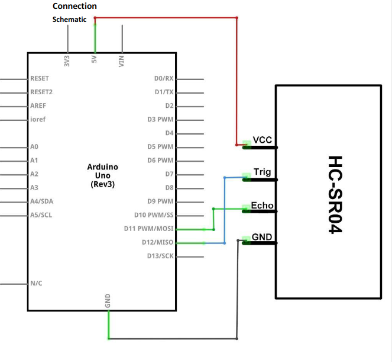

# Simple example for HC-SR04 (Ultrasonic) Sensor

# Requirements
- Arduino
- HC-SR04
- USB-Cable
- Arduino-IDE

# Install

- For circuit follow diagram

- Open `Sketch1` in Arduino-IDE
- Open Serial Monitor

This script just prints the distance in cm on the serial monitor.
